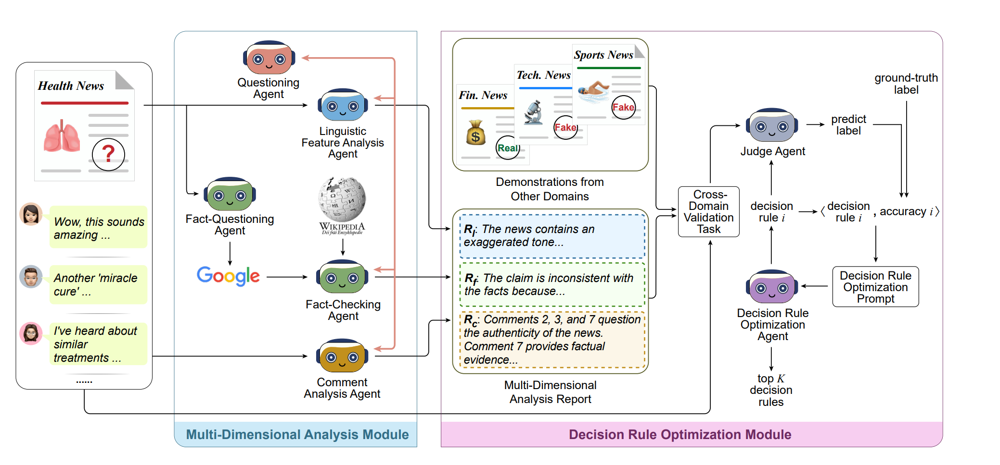

## 🤔 What is MARO?

MARO is an end-to-end multi-agent framework that empowers Large Language Models (LLMs) to detect cross-domain misinformation through automated analysis and optimized decision-making.



<center><em>Overview of the MARO framework</em></center>

## ⚙️ Installation

Please configure your environment and add your own API key and prompts in the code before running the Quick Start instructions below.

## 🚀 Quick Start

### 🔌 Step 1: Generate report

```bash
python MARO\report.py
```

### 🔍 Step 2: MARO

```bash
python MARO\INS.py
```

### 🧩 Step 3: Test

```bash
python MARO\test.py
```

## 📖 Citation

Please cite the following if you find MARO helpful:

```txt
@article{DBLP:journals/corr/abs-2503-23329,
  publtype={informal},
  author={Hui Li and Ante Wang and Kunquan Li and Zhihao Wang and Liang Zhang and Delai Qiu and Qingsong Liu and Jinsong Su},
  title={A Multi-Agent Framework with Automated Decision Rule Optimization for Cross-Domain Misinformation Detection},
  year={2025},
  month={March},
  cdate={1740787200000},
  journal={CoRR},
  volume={abs/2503.23329},
  url={https://doi.org/10.48550/arXiv.2503.23329}
}
```

